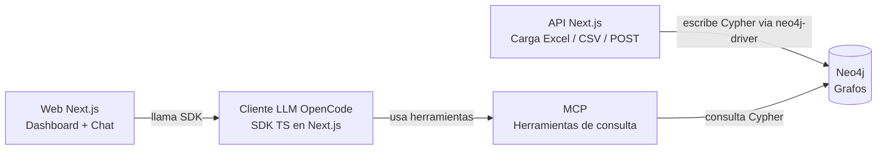

# Arquitectura

El proyecto tendrá lo siguiente
:

- Base de datos basada en grafos: Neo4j para persistir datos de preferencias de compra de los clientes
- API: para proveer una forma en al cual cargar datos por medio de excel, csv o por medio de POST al registrar una compra en el sistema al que se hará la integración.
- MCP: para proveer herramientas de consulta para la base de datos y que un LLM pueda hacer lecturas en la base de datos para generar reportes o recomendaciones segun los datos registrados sobre las preferencias de lo usuarios.
- Cliente LLM: OpenCode servido/embebido en Next.js vía SDK TypeScript para recomendaciones y reportes utilizando IA
- Web: Mostrar dhasboards sobre los datos guardados

Tecnologías a utilizar:

- Next.js: framework fullstack para desarrollar frontend y backend (Node 20+, Route Handlers en runtime Node).
- Neo4j: base de datos de grafos (Cypher). Conexión desde Next.js con `neo4j-driver` oficial para TypeScript.
- OpenCode SDK TypeScript (`@opencode-ai/sdk` + `@opencode-ai/sdk-next`): cliente LLM con modelos gratuitos integrado en la web. Instalación: `npm install @opencode-ai/sdk`. Uso embebido en Next.js sin puerto extra con `OpenCode.create()` de `@opencode-ai/sdk-next`, o modo servidor con `createOpencode()` + `client.session.create()` / `client.session.prompt({ path: { id }, body: { model, parts } })`. MCP Neo4j se registra en `opencode.json` (`mcp`).
- OpenCode: servidor/cliente LLM base (modelos gratuitos)
## Diagrama Mermaid:

