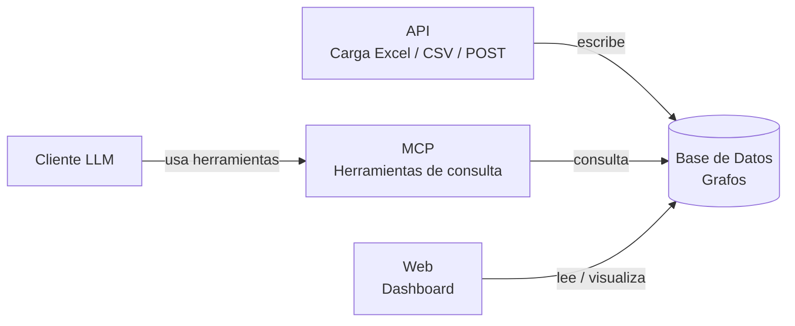

# Arquitectura

El proyecto tendrá lo siguiente
:

- Base de datos basada en grafos: para persistir datos de preferencias de compra de los clientes
- API: para proveer una forma en al cual cargar datos por medio de excel, csv o por medio de POST al registrar una compra en el sistema al que se hará la integración.
- MCP: para proveer herramientas de consulta para la base de datos y que un LLM pueda hacer lecturas en la base de datos para generar reportes o recomendaciones segun los datos registrados sobre las preferencias de lo usuarios.
- Cliente LLM: recomendaciones y reportes utilizando IA
- Web: Mostrar dhasboards sobre los datos guardados

Tecnologías a utilizar:

- Next.js: framework fullstack para desarrollar frontend y backend
- OpenCode: cliente LLM con modelos gratuitos
## Diagrama Mermaid:

