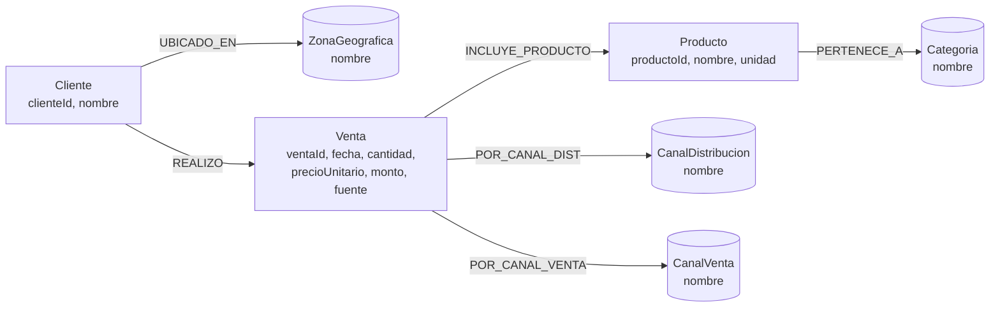

# Esquemas de datos

Motor: Neo4j (grafo de propiedades, lenguaje Cypher, driver oficial `neo4j-driver` para TypeScript/Next.js).

Fuente de análisis: `Data/Demo_Ventas.xlsx`, hoja `Ventas2025` (1294 filas, 0 nulos, 10 columnas) y `Data/Demo_Ventas_2024_2025.xlsx` (hoja `Ventas_2024_2025`: 2304 filas, 0 nulos, 22 columnas, Brasil 2024-2025; hojas `Catalogo_Productos`, `Puntos_Express`, `Guia_Ejercicio`).

Columnas origen: `Fecha, Cliente, Zona_Geografica, Canal_Distribucion, Canal_Venta, Producto, Categoria, Cantidad_kg_unid, Precio_Unitario_USD, Monto_Venta_USD`.

Valores observados:
- `Cliente` (10): Cafeterías Unidas, Despensa Familiar, Distribuidora Occidente, Food Service Premium, Hotel Las Palmeras, Maxi Despensa, Mercado Central SV, Pollo Campestre, Restaurante El Buen Sabor, Super Selectos.
- `Zona_Geografica` (5): Central, Costa, Occidente, Oriente, Paracentral.
- `Canal_Distribucion` (7): Cadena Supermercados, Distribuidores, Food Service, Hoteles, Institucional, Mercados Tradicionales, Restaurantes.
- `Canal_Venta` (3): Horeca, Mayorista, Retail.
- `Producto` (8): Alitas, Chorizo de Pollo, Huevos Docena, Jamon de Pavo, Muslo y Encuentro, Nuggets de Pollo, Pechuga de Pollo, Pollo Entero Fresco.
- `Categoria` (6): Cortes, Derivados, Embutidos, Huevos, Pollo, Procesados.
- Regla verificada: `Monto_Venta_USD = Cantidad_kg_unid * Precio_Unitario_USD` (diff máx 0.0).

## 1. Decisión de modelado (grafo Neo4j)

Se usa nodo reificado `:Venta` en lugar de solo relación `(:Cliente)-[:COMPRO]->(:Producto)` para:

1. Soportar a futuro una venta con N productos.
2. Permitir agregaciones por fecha / canal / zona para dashboard e IA.
3. Trazar `fuente: excel | csv | api` según historias de usuario.

Catálogos (`Zona, Categoria, Canales, Producto, Cliente`) son nodos, no strings sueltos, para consultar preferencias: "¿qué categorías prefiere cada cliente por zona?".

## 2. Nodos (labels Neo4j)

Constraints Neo4j sugeridos:
```cypher
CREATE CONSTRAINT cliente_nombre_unique IF NOT EXISTS FOR (c:Cliente) REQUIRE c.nombre IS UNIQUE;
CREATE CONSTRAINT producto_nombre_unique IF NOT EXISTS FOR (p:Producto) REQUIRE p.nombre IS UNIQUE;
CREATE CONSTRAINT venta_id_unique IF NOT EXISTS FOR (v:Venta) REQUIRE v.ventaId IS UNIQUE;
CREATE CONSTRAINT categoria_nombre_unique IF NOT EXISTS FOR (cat:Categoria) REQUIRE cat.nombre IS UNIQUE;
CREATE CONSTRAINT zona_nombre_unique IF NOT EXISTS FOR (z:ZonaGeografica) REQUIRE z.nombre IS UNIQUE;
CREATE CONSTRAINT canal_dist_unique IF NOT EXISTS FOR (cd:CanalDistribucion) REQUIRE cd.nombre IS UNIQUE;
CREATE CONSTRAINT canal_venta_unique IF NOT EXISTS FOR (cv:CanalVenta) REQUIRE cv.nombre IS UNIQUE;
```

### Cliente (`:Cliente`)
| Propiedad | Tipo | Requerido | Notas |
|---|---|---|---|
| `clienteId` | string (slug) | sí, PK | ej. `despensa-familiar`. Generado al normalizar `nombre`. |
| `nombre` | string | sí, UNIQUE | trim, 10 valores actuales. |
| `createdAt` | datetime | sí | |

### Producto (`:Producto`)
| Propiedad | Tipo | Requerido | Notas |
|---|---|---|---|
| `productoId` | string (slug) | sí, PK | ej. `pollo-entero-fresco`. |
| `nombre` | string | sí, UNIQUE | 8 valores actuales. |
| `unidad` | string | sí | default `kg/unid`. |
| `createdAt` | datetime | sí | |

### Categoria (`:Categoria`)
| Propiedad | Tipo | Requerido | Notas |
|---|---|---|---|
| `nombre` | string | sí, PK/UNIQUE | 6 valores actuales. |

### ZonaGeografica (`:ZonaGeografica`)
| Propiedad | Tipo | Requerido | Notas |
|---|---|---|---|
| `nombre` | string | sí, PK/UNIQUE | 5 valores actuales. |

### CanalDistribucion (`:CanalDistribucion`)
| Propiedad | Tipo | Requerido | Notas |
|---|---|---|---|
| `nombre` | string | sí, PK/UNIQUE | 7 valores actuales. |

### CanalVenta (`:CanalVenta`)
| Propiedad | Tipo | Requerido | Notas |
|---|---|---|---|
| `nombre` | string | sí, PK/UNIQUE | `Horeca | Mayorista | Retail`. |

### Venta (`:Venta`)
| Propiedad | Tipo | Requerido | Notas / validación |
|---|---|---|---|
| `ventaId` | string (uuid) | sí, PK | generado en API. En carga masiva: `rowId` o uuid. |
| `fecha` | date | sí | ISO 8601 `YYYY-MM-DD`. Rango sample 2025-01-01 a 2025-12-31. |
| `anio` | number | no | origen `Año` (dataset 2024-2025). |
| `mes` | number 1-12 | no | origen `Mes`. |
| `cantidad` | number (>0) | sí | origen `Cantidad_kg_unid` o `Unidades`. |
| `precioUnitario` | number (>0) | sí | USD o R$ según `moneda`. |
| `moneda` | enum | no | `USD | BRL`, default `USD`. |
| `monto` | number (>0) | sí | `cantidad * precioUnitario`, redondeo 2 decimales. No se acepta si difiere. |
| `stockDisponible` | number (≥0) | no | origen `Stock_Disponible_Unidades`. Sin esto el pedido sugerido es cota máxima. |
| `leadTimeDias` | number (≥0) | no | origen `Lead_Time_Días`. |
| `promocion` | boolean | no | origen `Promoción` (`Sí/No`). |
| `devoluciones` | number (≥0) | no | origen `Devoluciones_Unidades`. |
| `pedidoSugerido` | number (≥0) | no | origen `Pedido_Sugerido_Base` o calculado con la regla. |
| `montoNeto` | number (≥0) | no | origen `Ventas_Netas_R$` (= monto − devoluciones valoradas). |
| `demanda30d` | number (≥0) | no | origen `Demanda_30d_Estimada`. Input de la regla de pedido. |
| `stockSeguridad` | number (≥0) | no | origen `Stock_Seguridad_20pct`. 20% de la demanda; se guarda para auditar la regla por fila. |
| `fuente` | enum | sí | `excel | csv | api`. |
| `createdAt` | datetime | sí | |

### PuntoExpress (`:PuntoExpress`)
Punto de venta del dataset 2024-2025 (8 puntos, São Paulo). Equivalente operativo a `Cliente` para ese dataset.

| Propiedad | Tipo | Requerido | Notas |
|---|---|---|---|
| `codigo` | string | sí, PK/UNIQUE | ej. `SP-EXP-01`. Origen `Punto`. |
| `nombre` | string | sí | origen `Nombre_Punto`. |
| `canal` | string | sí | `Supermercado | Mayorista`. |
| `region` | string | sí | origen `Región`. |

Constraint sugerido:
```cypher
CREATE CONSTRAINT punto_codigo_unique IF NOT EXISTS FOR (pt:PuntoExpress) REQUIRE pt.codigo IS UNIQUE;
```

## 3. Relaciones (tipos Neo4j)

| Origen → Destino | Tipo | Cardinalidad | Propósito |
|---|---|---|---|
| `Cliente → ZonaGeografica` | `UBICADO_EN` | N:1 | zona actual del cliente (se actualiza si cambia). |
| `Cliente → Venta` | `REALIZO` | 1:N | trazabilidad de compras. |
| `Venta → Producto` | `INCLUYE_PRODUCTO` | N:1 | v1: una venta = un producto. v2: permitir N. |
| `Venta → CanalDistribucion` | `POR_CANAL_DIST` | N:1 | dimensión dashboard. |
| `Venta → CanalVenta` | `POR_CANAL_VENTA` | N:1 | dimensión dashboard. |
| `Producto → Categoria` | `PERTENECE_A` | N:1 | ej. `Pollo Entero Fresco → Pollo`. |
| `PuntoExpress → Venta` | `REGISTRO` | 1:N | ventas del dataset 2024-2025 por punto. |

No se guarda `Zona` ni `Categoria` duplicados en `Venta`; se resuelven por grafo.

## 4. Diagrama Mermaid (grafo)



## 5. Esquema de ingesta (API)

Mismo contrato para `POST /api/compras`, carga `Excel` y `CSV`. El header del archivo debe mapear 1:1 a estos campos.

| Campo API | Origen Excel | Tipo | Validación |
|---|---|---|---|
| `fecha` | `Fecha` | string date | requerido, `YYYY-MM-DD`, no futura. |
| `cliente` | `Cliente` | string | requerido, trim, min 2. Crea `Cliente` si no existe. |
| `zonaGeografica` | `Zona_Geografica` | string | requerido, crea `Zona` si no existe. |
| `canalDistribucion` | `Canal_Distribucion` | string | requerido. |
| `canalVenta` | `Canal_Venta` | enum | requerido, `Horeca | Mayorista | Retail`. |
| `producto` | `Producto` | string | requerido. |
| `categoria` | `Categoria` | string | requerido, debe coincidir con categoría existente del producto o crearla si producto es nuevo. |
| `cantidad` | `Cantidad_kg_unid` | number | requerido, >0. |
| `precioUnitario` | `Precio_Unitario_USD` | number | requerido, >0. |
| `monto` | `Monto_Venta_USD` | number | opcional: si se omite se calcula; si se envía se valida contra `cantidad*precioUnitario` ±0.01. |

Normalización: trim + case preservado para display, slug lower-case para IDs. `fecha` sin hora (hora 00:00).

### Ejemplo `POST /api/compras`

```json
{
  "fecha": "2025-01-02",
  "cliente": "Despensa Familiar",
  "zonaGeografica": "Occidente",
  "canalDistribucion": "Cadena Supermercados",
  "canalVenta": "Horeca",
  "producto": "Muslo y Encuentro",
  "categoria": "Cortes",
  "cantidad": 676,
  "precioUnitario": 8.89,
  "monto": 6009.64,
  "fuente": "api"
}
```

Respuesta `201`:

```json
{
  "ventaId": "0193a2f0-...",
  "montoCalculado": 6009.64,
  "dedup": false
}
```

### Ejemplo creación en Neo4j (Cypher, referencial)

Ejecutado desde Next.js con `neo4j-driver` (sesión con `session.executeWrite`).

```cypher
MERGE (c:Cliente {nombre: $cliente})
MERGE (z:ZonaGeografica {nombre: $zonaGeografica})
MERGE (c)-[:UBICADO_EN]->(z)
MERGE (p:Producto {nombre: $producto})
MERGE (cat:Categoria {nombre: $categoria})
MERGE (p)-[:PERTENECE_A]->(cat)
MERGE (cd:CanalDistribucion {nombre: $canalDistribucion})
MERGE (cv:CanalVenta {nombre: $canalVenta})
CREATE (v:Venta {ventaId: $ventaId, fecha: date($fecha), cantidad: $cantidad, precioUnitario: $precioUnitario, monto: $cantidad * $precioUnitario, fuente: $fuente})
CREATE (c)-[:REALIZO]->(v)
CREATE (v)-[:INCLUYE_PRODUCTO]->(p)
CREATE (v)-[:POR_CANAL_DIST]->(cd)
CREATE (v)-[:POR_CANAL_VENTA]->(cv);
```

## 7. Wizard de mapeo con IA (archivos con otra estructura)

`POST /api/mapear-columnas` recibe un Excel/CSV, muestra columnas + 3 muestras y pide a Big Pickle el mapeo `{columna_origen: campo_destino | null}` (`CAMPOS_DESTINO` en `lib/validations.ts`, incluye `anio, mes, stockDisponible, leadTimeDias, promocion, devoluciones, pedidoSugerido`). Si la IA falla, fallback local por alias. La UI (`/upload` → Wizard con IA) deja ajustar cada columna y `POST /api/upload-mapeado` carga con ese mapeo (detecta `BRL` por columnas originales).

## 8. Consultas que habilita (Neo4j / MCP / Dashboard / Chat IA)

- Top productos por cliente: `Cliente → Venta → Producto` sum `monto/cantidad`.
- Preferencia por categoría/zona: agregación vía `PERTENECE_A` y `UBICADO_EN`.
- Serie temporal: `Venta.fecha` por mes para sugerir cargamento.
- Corte por canal: `POR_CANAL_DIST / POR_CANAL_VENTA`.
