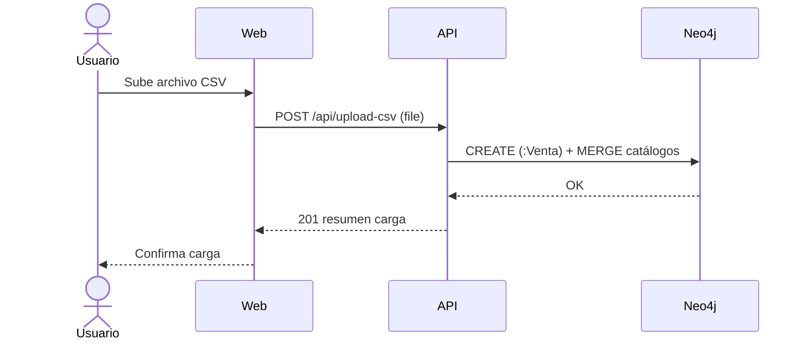
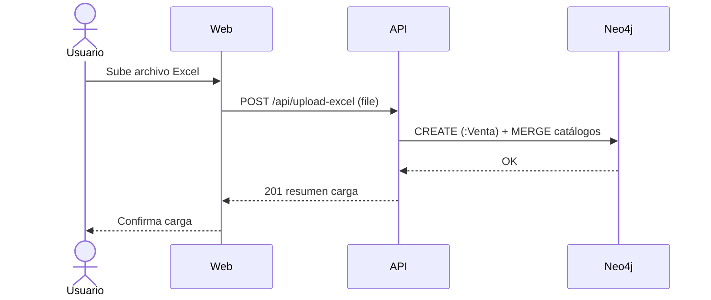
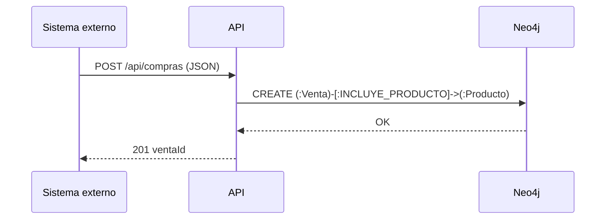
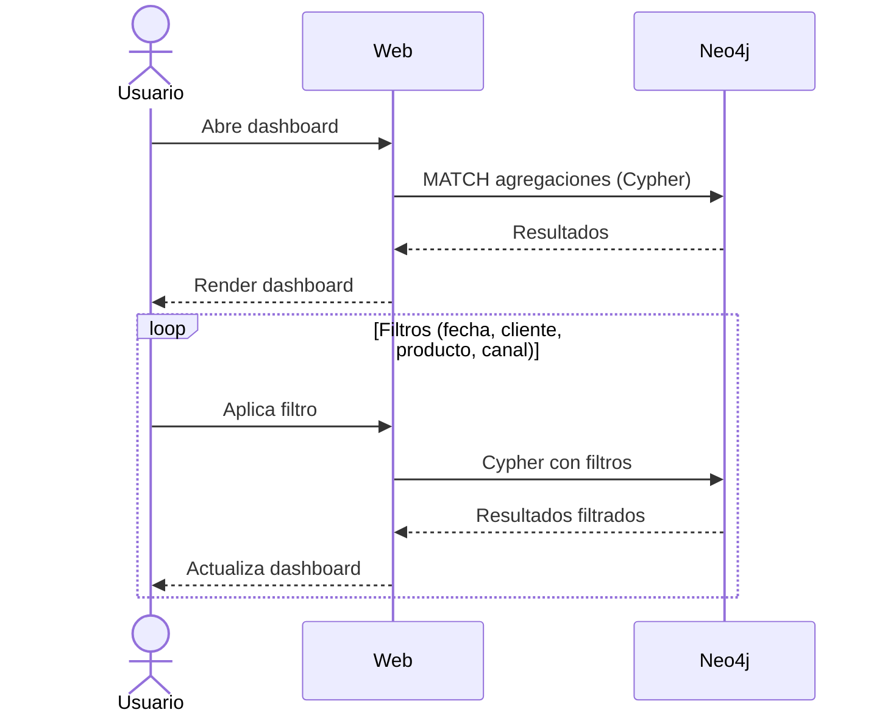
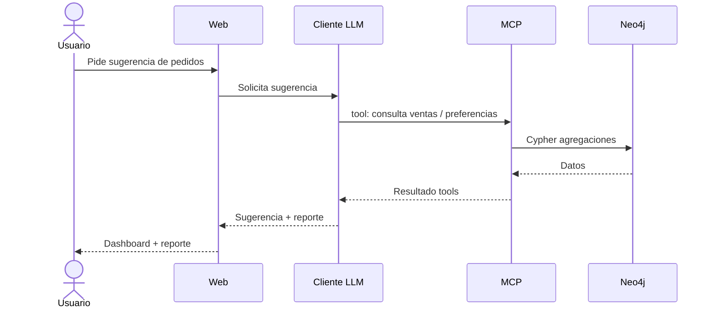
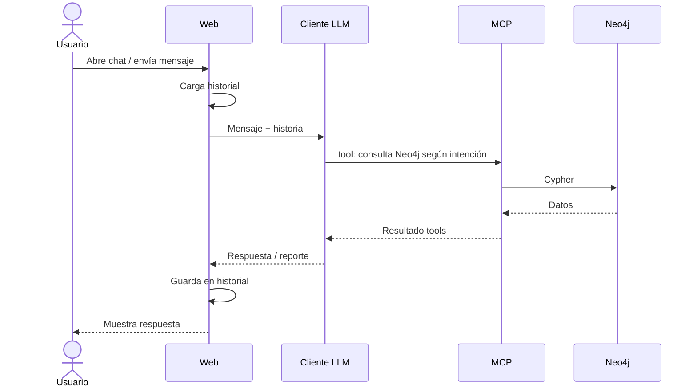

# Procesos

**Subir datos con CSV:**
- En la web se sube el archivo CSV
- La web envía el archivo CSV a la API
- La API carga los datos en la base de datos basada en grafos

**Subir datos con Excel:**

- En la web se sube el archivo Excel en un formulario
- La web envía el archivo Excel a la API
- La API carga los datos en la base de datos basada en grafos

**Guardar ventas nuevas:**

- En un sistema externo se registra una venta y envia un POST a la API
- La API guarda la venta en la base de datos basada en grafos

> Este proceso es útil para conectar la solución con otros sistemas y constantemente actualizar los datos. Esto permite que el LLM pueda responder mejor en los chats o que los dashboard contengan más información útil.

**Ver dashboard:**

- En la web hay una página para ver un dashboard general sobre las ventas
- La web lee los datos que hay en la base de datos basada en grafos
- El usuario puede navegar o aplicar filtros para hacer busquedas concretas basado en fechas u otro tipo de datos

**Generar sugerencias de pedidos:**

- En la web hay una página para generar sugerencias de pedidos
- La web pide al cliente LLM que consulte datos de la base de datos usando el MCP
- El cliente LLM sugiere pedidos segun los habitos y comportamientos de los clientes basados en las ventas registradas
- La web presenta un dashboard al usuario y un reporte de los pedidos sugeridos

**Chat interactivo con IA:**

- En la web hay una página para iniciar un chat con inteligencia artificial
- El usuario puede chatear para consultar datos guardados en la base de datos basado en grafos para generar reportes o búsquedas concretas
- El cliente LLM usa el MCP para consultar la base de datos
- Es necesario tener historial de chats en la web para poder acceder nuevamente a las conversaciones

